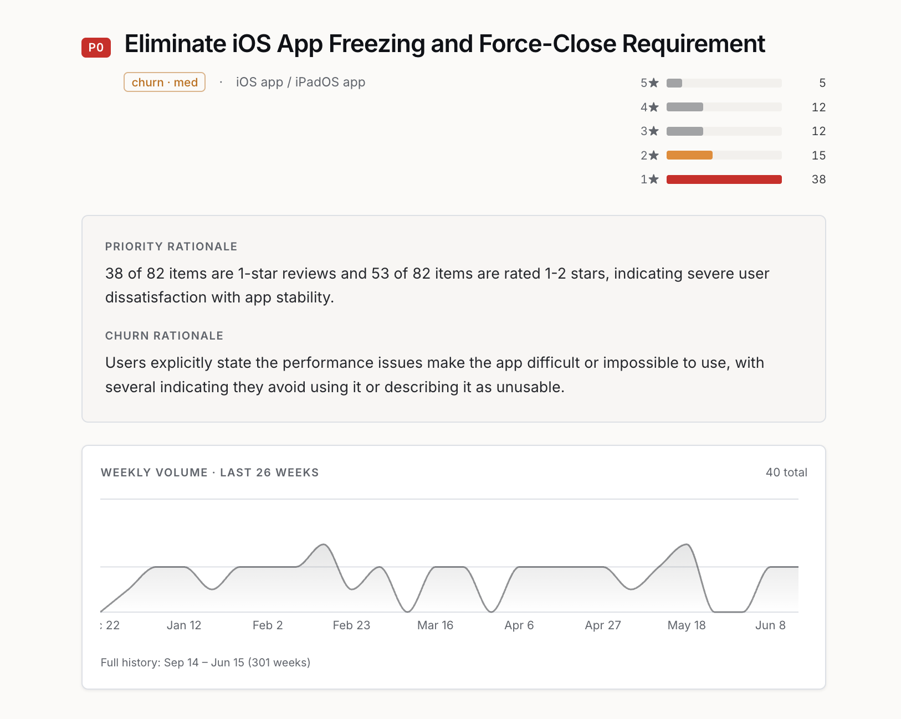

# PRISM

**Turns thousands of scattered user reviews into a ranked list of what to fix — and shows
you the receipts for every claim.**

A product team drowns in feedback. App Store reviews, support tickets, Twitter, G2, user
interview recordings. Nobody can read it all, so critical patterns surface late: a crash
affecting 12% of users, a feature 300 people asked for, a bug quietly churning paying
customers.

PRISM ingests it, clusters it, and uses Claude to write a prioritised insight report for
each theme — with **every finding traceable to the actual reviews it came from.**

Built on **1,820 real Notion iOS App Store reviews** (US/GB/CA/AU, 2017–2026).

---

## What it found

Unprompted, from raw review text:

| Priority | Theme | Items | Churn |
|---|---|---|---|
| **P0** | Eliminate iOS app freezing and force-close requirement | 82 | med |
| **P0** | Critical login loop prevents access to accounts and paid subscriptions | 50 | **high** |
| **P0** | Investigate login-triggered permanent data loss affecting 29 users | 29 | **high** |
| **P1** | Remove forced AI prompts from core writing and homepage surfaces | 115 | med |
| **P1** | Resolve iOS/iPad app crashes and auto-refresh loop | 45 | med |

The AI-backlash theme (115 items) is a genuine product-strategy signal nobody searched for.
The data-loss theme surfaced users being **prompted to pay to recover notes the app lost.**


---

## The core idea: every claim shows its receipts

The Synthesiser's failure mode is invisible — **a hallucinated report reads beautifully and
is wrong.** A clustering bug produces obviously-bad clusters. A synthesis bug produces a
fluent, confident paragraph asserting things no user ever said.

So every finding cites the specific reviews it came from, and the UI shows them:



Note the 4-star review praising the app while describing the exact bug. The model isn't
summarising sentiment — it's extracting a specific, verifiable claim.

---

## Measured, not asserted

The eval harness was built, run against the existing output, and **it failed it.**

| Metric | Original | After fixes | Threshold |
|---|---|---|---|
| **Faithfulness rate** | 0.839 | **0.925** | ≥ 0.90 |
| **Numeric guard violations** | 7 | **0** | 0 |
| **Hallucinated citation rate** | 0.000 | **0.000** | ≤ 0.02 |

Same frozen inputs across every run. Only the prompt changed. **The threshold was never
moved to make it pass.**

Three real failures it caught:

- **Invented specificity inside a correctly-cited claim.** "exam materials due within 2
  days", "3+ years" — real citations, fabricated details. *Citation-grounding proves a
  source exists; it does not prove the claim represents it.*
- **A hallucinated date range** ("2021–2026") in a recommended action, when every review is
  dated 2026.
- **Churn risk returned "high" for 20 of 22 themes.** A signal that fires 91% of the time
  is a constant, not a metric.

**The instrument was wrong before the model was.** The first eval reported 77.3%
faithfulness — but the judge couldn't see the system-verified statistics the Synthesiser was
legitimately given, so it was failing correct claims. Real number: 83.9%.

Full methodology, failure catalogue, and residual limitations: **[EVAL.md](EVAL.md)**

---

## Architecture

```
App Store connector ──┐
Google Play           ├──▶ Postgres + pgvector
HackerNews            │         │
Reddit             ───┘         ▼
                        ┌───────────────────────────────┐
                        │  LangGraph pipeline           │
                        │                               │
                        │  Ingestor    (no LLM)         │
                        │  Clusterer   (no LLM)         │  MiniLM → UMAP → HDBSCAN
                        │  Labeller    (Claude)         │  1 call per cluster
                        │  Synthesiser (Claude)         │  1 call per theme
                        │  Alerter     (no LLM)         │  rolling Z-score
                        └───────────────────────────────┘
                                    │
                        FastAPI ───▶ TanStack dashboard
```

**Model tiering is load-bearing, not decoration.** Claude is called **once per cluster** —
never per item. Embedding, dimensionality reduction, clustering, and anomaly detection use
**no LLM at all**. Result: **~$0.22 per full pipeline run** over 1,820 items. Routing
everything through Claude would cost ~9× more and be no better.

| Stage | Approach | Why |
|---|---|---|
| Embedding | `all-MiniLM-L6-v2`, 384-dim, **CPU-pinned** | MPS is non-deterministic — two runs gave 107 vs 109 clusters. An eval baseline that moves measures nothing. |
| Dimensionality reduction | UMAP → 10-dim, cosine | HDBSCAN on raw 384-dim collapsed into one 119-item mega-blob (curse of dimensionality). |
| Clustering | HDBSCAN, `min_cluster_size=12` | Tuned by reading the clusters, not by chasing a target count. |
| Noise rescue | Euclidean + p90 distance cap | Cosine-to-centroid in UMAP space rescued **100%** of noise — UMAP output isn't origin-centred, so cosine can't discriminate. Euclidean rescues 9%, correctly leaving genuine outliers out. |
| Cluster merging | **One** Claude call over all labels | Merging on label-string embeddings merged 1 of 40 clusters at any threshold — short labels share no vocabulary even when identical in meaning. A semantic problem needed a semantic fix. |

### The merge insight

The dedupe prompt had to be told that **merge tolerance is asymmetric by category**:

- **Praise merges aggressively.** Nobody needs five flavours of "I love it."
- **Bugs merge conservatively.** Two bugs merge only if one engineer fixes both with one
  change. "iPad crashes" and "iPad keyboard input fails" are different tickets.

Before: one 197-item "iPad and iOS Performance Issues" blob — useless to a PM.
After: eight distinct, individually-assignable bug themes.

---

## The Alerter: a negative result

Anomaly detection was built — rolling Z-score, no leakage, floors against sparse-data false
positives, `insufficient_history` distinguished from "no spike", reviewer-verified, tested.

**It found three spikes. All sit exactly on the minimum floor (count=5) against near-zero
baselines. Two vanish if the floor moves from 5 to 8.**

A z-score of 10.97 sounds dramatic. It means *five reviews in a week for a theme that
normally sees zero or one.*

**So the alerts strip ships disabled.** The trend data is real and surfaced — a flat line
means a chronic annoyance, a rising line means something is getting worse. But presenting
those three blips to a PM as actionable alerts would overstate the evidence.

A red banner reading *"10.97σ spike"* would have been the flashiest thing on the dashboard.
It is also, on inspection, five reviews.

*Building the feature was the easy part. Measuring it, disbelieving it, and turning it off
was the work.*

---

## Stack

**Backend** — Python 3.12, FastAPI (async), Pydantic v2, SQLAlchemy 2 + Alembic,
PostgreSQL 16 + pgvector, LangGraph, sentence-transformers, UMAP, HDBSCAN, Anthropic SDK

**Frontend** — TanStack Start (React 19), TypeScript, Tailwind, Recharts, framer-motion

**Infra** — AWS CDK (TypeScript): ECS Fargate, RDS, ALB, ECR, Secrets Manager, GitHub OIDC

**Testing** — 178 backend tests + 18 infra tests. Eval regression gate in CI.

---

## Deployment

Full AWS infrastructure as code in [`infra/`](infra/). `cdk synth` clean, 18 infra tests
passing, `make deploy` brings the whole stack up.

Deliberate cost decisions, each documented in the stack:

- **Zero NAT gateways** (~$33/mo saved) — public subnets with tightly-scoped security
  groups. The Fargate task's SG is the only ingress to RDS; the ALB's SG is the only ingress
  to the task. A production deployment would use private subnets + NAT; this is a portfolio
  app and the trade-off is explicit.
- Everything tears down cleanly — `deletionProtection: false`, `emptyOnDelete` on ECR,
  no final snapshots, 7-day log retention. `make destroy` leaves nothing billing.
- Estimated **~$62/mo**.

**Not currently deployed.** AWS free-plan accounts cap RDS at two instances; both are in use
by another project. The stack is the artifact — it is correct, tested, and one command from
running.

---

## Things deliberately not built

- **A per-item Enricher agent.** Designed, then found redundant — the cluster-level Labeller
  already produced the category and sentiment fields it would have extracted. One Claude call
  per cluster beat 1,820 GPT calls per item. Deleted rather than built.
- **A category pie chart.** It tells a PM that 30% of feedback is bugs. That changes no
  decision.
- **Sentiment-over-time.** The corpus is a single static scrape. A trend line would be a
  flat line pretending to be an insight.
- **The alerts strip.** See above.

---

## Run it

```bash
docker compose up -d                    # postgres + pgvector, redis
cd backend
python -m venv venv && source venv/bin/activate
pip install -r requirements.txt
alembic upgrade head
uvicorn main:app --reload

# ingest, cluster, label, synthesise
curl -X POST "localhost:8000/api/v1/connectors/app-store/sync?app_id=1232780281&count=500"
curl -X POST "localhost:8000/api/v1/pipeline/run"
curl "localhost:8000/api/v1/insights"

# eval
cd .. && python eval/run_eval.py
```

Needs `ANTHROPIC_API_KEY` in `backend/.env`.

Frontend: `cd frontend && npm install && npm run dev`